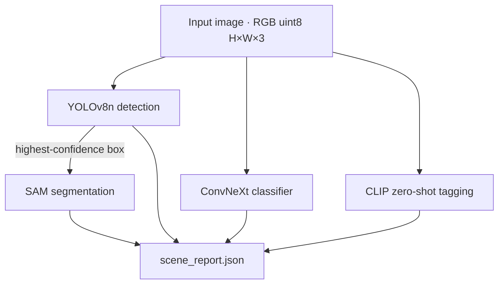
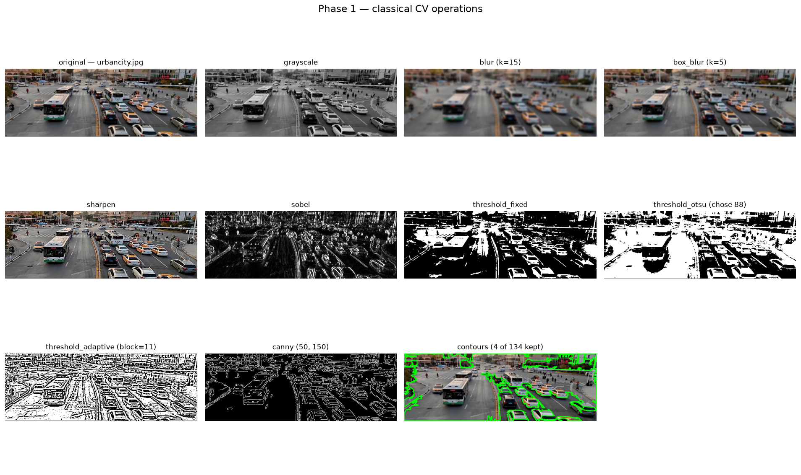

# VisionForge

A Streamlit computer vision lab that puts classical OpenCV, a fine-tuned image classifier, YOLO detection, SAM segmentation and CLIP zero-shot tagging behind one interface.


*Every mode shares the same sidebar: pick a mode, pick an image, tune the parameters. Here, Document mode showing a scanned insurance form at each stage of the workflow.*

## Overview

VisionForge exists to make the different layers of computer vision comparable side by side. Most tutorials teach one technique in isolation — a notebook for filters, another for a CNN, another for YOLO — and you never see how their outputs relate on the same image.

Here every technique is a module with an identical signature, so the app can run any of them on the same input and the full pipeline is a loop rather than a special case. Feed in one image and you can:

- Step through classical operations (threshold → morphology → contours) and watch each stage
- Get a top-5 land-use classification from a ConvNeXt fine-tuned on EuroSAT
- Detect COCO objects with YOLOv8 and segment the best one with SAM
- Tag the scene with CLIP against a label set you define at runtime
- Chain all of it into a single `scene_report.json`

The JSON report is the actual deliverable. The overlays are there so a human can check the numbers are sane.

The project is deliberately honest about domain limits: the classifier only knows 10 EuroSAT land-use classes, YOLO only knows the 80 COCO classes, and CLIP can only answer with a label you hand it. The app says so in the UI rather than hiding it, and a separate **Document** mode exists precisely because none of those models belong anywhere near a scanned page.

## Features

- **One contract for every module** — each returns a `CVResult(overlay, data, meta)`, so adding a technique never changes the app
- **12 classical OpenCV operations** with live parameter controls
- **Document / Text Processing mode** — a three-panel view of the binarise → dilate → contour workflow, tuned for scanned pages
- **Full pipeline mode** — detection, classification, segmentation and tagging chained into one downloadable report with per-stage timings
- **CPU-only inference** — nothing here needs a GPU; training happens separately in Colab
- **Configurable without code** — model names, CLIP label sets and document defaults live in `config.yaml`, and every module carries its own fallbacks so deleting the file still leaves a working app

## Pipeline

Full Pipeline mode runs the four model-backed modules in dependency order. Segmentation is prompted by the highest-confidence detection box rather than a guessed point, which is why detection has to run first.



If detection finds nothing, segmentation is skipped and the detection overlay is shown instead. Classification failures (typically a missing checkpoint) are caught and recorded in the report rather than taking the whole run down.


*Full Pipeline on `data/samples/urbancity.jpg`. The stage-runtime chart is the reason the pipeline records timings per stage rather than one total — segmentation dwarfs everything else on CPU.*

## Tech stack

| Area | What is used |
|------|--------------|
| Classical CV | OpenCV (`opencv-python`) |
| Deep learning | PyTorch (CPU builds), `timm` for the classifier backbone |
| Detection | Ultralytics YOLOv8n |
| Segmentation | `facebook/sam-vit-base` via HF `transformers` |
| Zero-shot | `openai/clip-vit-base-patch32` via HF `transformers` |
| UI | Streamlit |
| Supporting | NumPy, Pillow, pandas, PyYAML, matplotlib (grid script only) |

A few deliberate choices worth noting:

- **`timm`, not `torchvision.models`.** torchvision is used only for transforms and the EuroSAT dataset loader.
- **Ultralytics YOLO is AGPL-3.0.** Fine for a portfolio project, but if you need a permissive licence, RF-DETR is the Apache-2.0 alternative.
- **SAM and CLIP share one dependency.** Both load through `transformers`, which is why neither has its own SDK here. SigLIP is CLIP's stronger successor and drops in the same way if you want to swap.

## Project structure

```
app.py                  Streamlit UI — three modes, no CV logic
config.yaml             model names, CLIP label sets, document defaults
src/
  base.py               the CVResult dataclass every module returns
  utils.py              image I/O (BGR→RGB once, at the boundary), drawing, config
  opencv_ops.py         12 classical operations behind one dispatch table
  classification.py     EuroSAT classifier inference
  detection.py          YOLOv8 inference
  segmentation.py       SAM, prompted with a box or a point
  clip_module.py        CLIP zero-shot scoring
  pipeline.py           chains the four model modules into scene_report.json
scripts/
  smoke_test.py         runs every module and asserts the contract holds
  make_grid.py          regenerates assets/opencv_grid.png
notebooks/
  train_classifier.py   the only place training happens (built for Colab)
data/samples/           5 committed test images
models/                 classifier weights (gitignored)
```

Model loading lives inside each module behind a lazy cache keyed by weights path, so Streamlit reruns don't reload a checkpoint on every slider move. Modules never mutate their input — OpenCV's drawing functions write in place, so overlays are always built on a copy.

## Installation

Python 3.11 is what this was built and tested on.

```powershell
git clone https://github.com/luffy007007/vision-forge.git
cd vision-forge

python -m venv .venv
.venv\Scripts\activate

pip install -r requirements.txt
```

```bash
# macOS / Linux
python3 -m venv .venv
source .venv/bin/activate
pip install -r requirements.txt
```

`requirements.txt` pins the CPU-only PyTorch wheels and includes the extra PyPI index they come from, so no separate torch install step is needed.

### Model weights

Three of the four models download themselves on first use and cache locally:

| Model | Size | Source |
|-------|------|--------|
| `yolov8n.pt` | ~6 MB | Ultralytics, on first detection run |
| `facebook/sam-vit-base` | ~375 MB | Hugging Face, on first segmentation run |
| `openai/clip-vit-base-patch32` | ~600 MB | Hugging Face, on first CLIP run |

The EuroSAT classifier is **not** included — checkpoints are gitignored. To produce `models/classifier.pt`, run the training script (Colab with a GPU is what it was written for; it downloads EuroSAT itself):

```bash
python notebooks/train_classifier.py
```

It writes `classifier.pt` to the working directory — move it to `models/classifier.pt`. Without it, Classification mode raises and the full pipeline records the error in the report and carries on.

The checkpoint stores its own architecture and class order:

```python
{"model": "convnext_tiny", "classes": [...], "state_dict": {...}}
```

so the class list is never hardcoded anywhere — an argmax index is meaningless without it.

## Usage

```powershell
streamlit run app.py
```

Pick a sample image or upload your own in the sidebar, then choose a mode:

**General Image** — one task at a time. OpenCV operations update live as you move the sliders; the model-backed tasks wait for a **Run** button, since the first call downloads weights. Every result shows the input and output side by side, plus the raw `data` and `meta` dictionaries.

**Document / Text Processing** — for scans, forms and pages of text. Shows the input, the thresholded-and-dilated intermediate, and the detected text regions boxed, with the region count and the threshold Otsu picked. Classical OpenCV only, by design.

**Full Pipeline** — runs all four models, shows the segmented best detection, a bar chart of per-stage runtimes, and the complete `scene_report.json` with a download button.

Whichever mode you are in, the sidebar exposes the parameters and the main panel ends with the raw `data` and `meta` dictionaries the module returned:


*A deliberately bad setting, and what it looks like from the data side: `erode` instead of `dilate` shrinks the ink until only one region survives out of three contours found. The parameters and their consequences are always both on screen.*

Command-line entry points:

```bash
python scripts/smoke_test.py           # every module + contract checks
python scripts/smoke_test.py --fast    # skip the model-backed checks
python scripts/make_grid.py            # regenerate assets/opencv_grid.png
python scripts/make_grid.py data/samples/text.jpg
```

`smoke_test.py` is the whole test strategy. It catches the failure that actually happens: a module quietly breaking the shared contract after a refactor. It checks that every overlay comes back RGB uint8 at the input's size, that `data` and `meta` are JSON-serialisable, that inputs aren't mutated, and that the document workflow still finds text-line-sized regions.

## Modules

### Classical operations (`opencv_ops.py`)

All twelve share one dispatch table, which is also what populates the Streamlit dropdown — the two can't drift apart.



*Generated by `scripts/make_grid.py`. Settings were chosen to make the differences visible rather than to be optimal.*

| Operation | What it does |
|-----------|--------------|
| `grayscale` | RGB → single channel, reports mean intensity |
| `blur` | Gaussian blur, odd kernel |
| `box_blur` | The same idea with a kernel you can read — a hand-written convolution |
| `sharpen` | 3×3 kernel with an adjustable centre weight |
| `sobel` | Hand-built edge kernel; transposing it swaps which edges respond |
| `threshold_fixed` | Binarise at a value you choose |
| `threshold_otsu` | Binarise at a split point read off the histogram |
| `threshold_adaptive` | Per-neighbourhood threshold, for uneven lighting |
| `canny` | Canny edges, optional pre-blur, reports edge pixel count |
| `morphology` | erode / dilate / open / close with a rectangular kernel |
| `contours` | External contours above an area floor that scales with image size |
| `text_regions` | The document workflow end to end: binarise, dilate sideways, box what survives, sorted in reading order |

Two details that matter more than they look: **inversion** decides which side of a threshold is the foreground (a scanned page needs dark ink as foreground, or the paper becomes the object and the text becomes holes in it), and **kernel shape** drives the document workflow — a wide flat 25×3 kernel spreads sideways only, merging a line of text into one blob while leaving the gap between lines intact.

### Model modules

| Module | Model | Output |
|--------|-------|--------|
| `classification` | `convnext_tiny` fine-tuned on EuroSAT RGB | Top-5 land-use classes with probabilities |
| `detection` | YOLOv8n, COCO 80 classes | Boxes, labels, scores; adjustable confidence and NMS IoU |
| `segmentation` | SAM ViT-B | Binary mask + area, coverage fraction and SAM's own IoU score |
| `clip_module` | CLIP ViT-B/32 | Ranked scores over a runtime label set |

Two implementation notes worth knowing if you extend these: SAM returns three candidate masks per prompt and they are **not** sorted, so the module picks the one SAM scored highest rather than taking index 0. And Ultralytics wants BGR while the HF processors want RGB — the conversion happens inside each module, so callers always pass RGB.


*The clearest look at what SAM actually returns. YOLO's box says roughly where the banana is; SAM turns that box into a pixel-accurate mask, which is what `mask_area_px` and `mask_fraction` in the report are measured from.*

### Classifier results

`convnext_tiny` (ImageNet-pretrained) fine-tuned on EuroSAT RGB — 27,000 64×64 Sentinel-2 tiles, 10 classes, 80/20 split (seed 0). Trained on Colab, one T4, 5 epochs per run.

| Run | Trainable | LR | Val accuracy |
|-----|-----------|-----|--------------|
| A | classifier head only, backbone frozen | 1e-3 | 0.9530 |
| B | + last ConvNeXt stage unfrozen | 1e-4 | 0.9719 |

The interesting part is the size of the delta, not the final number. A frozen ImageNet backbone with nothing but a linear head trained already reaches ~95% on overhead satellite imagery — the features transfer almost intact, and unfreezing a stage buys under two points on top. Epoch-to-epoch variation within a run was ~0.3%, so the gain is real but small. Both figures are the final epoch, not the best (Run A actually peaked at 0.9557 on epoch 2).

Two runs, then stop. Chasing another point of accuracy was out of scope.

## Example

Full Pipeline on `data/samples/urbancity.jpg` — a street scene. Trimmed to the first detection:

```json
{
  "objects": [
    {
      "box": [346.16, 64.82, 419.75, 126.21],
      "label": "bus",
      "score": 0.871
    }
  ],
  "scene": {
    "classifier_top1": "SeaLake",
    "clip_tags": [
      { "label": "a city street",   "score": 0.9560 },
      { "label": "a page of text",  "score": 0.0175 },
      { "label": "an object",       "score": 0.0128 }
    ]
  },
  "segmentation": {
    "prompted_by": "bus",
    "mask_area_px": 2960,
    "mask_fraction": 0.0181,
    "mask_score": 0.958
  },
  "meta": {
    "stages": {
      "detection": 1.847,
      "classification": 0.584,
      "segmentation": 28.431,
      "clip": 4.803
    },
    "runtime_s": 66.701
  }
}
```

Twenty-three objects were found in total. Runtimes are from a CPU-only machine and vary a fair amount run to run — the screenshot above was a faster pass over the same image — but the shape never changes: SAM dominates, which is exactly what the per-stage breakdown exists to show.

Note `classifier_top1: "SeaLake"` on a photo of a city street. That is not a bug: softmax always sums to 1, so a model that only knows 10 satellite land-use classes will answer confidently on an input from a domain it has never seen. Making that visible rather than hiding it is the point of showing every stage's output.

## Limitations

- Inference is synchronous and single image. No batching, no queues.
- CPU only. SAM takes ~30s per call here; a GPU changes that entirely, but nothing in the code assumes one.
- Every model is domain-bound (10 EuroSAT classes / 80 COCO classes / whatever labels you give CLIP). Out-of-domain inputs still produce a complete report — it just isn't meaningful.
- The classifier checkpoint isn't distributed with the repo; you have to train it.

## Roadmap

Not implemented, in rough priority order:

- FAISS image similarity search over the sample set
- ONNX export for the classifier
- A linear probe as a baseline to compare against the fine-tuned head
- OCR on the regions Document mode already finds (EasyOCR)

## Licence

No licence file yet. 

## Author

Built by [luffy007007](https://github.com/luffy007007) as a breadth first tour of the computer vision stack.
